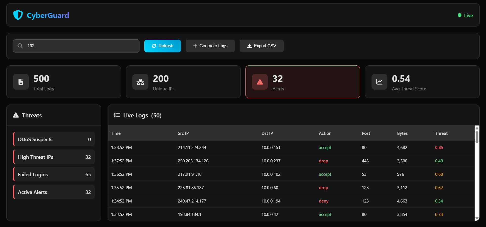

# CyberGuard-Logs-Analyzer
Repository Name: CyberGuard-Logs-Analyzer Description: 🔒 Real-time Cybersecurity Logs Analyzer with Threat Detection Tags: cybersecurity, logs, flask, security, dashboard License: MIT

# 🔒 CyberGuard Logs Analyzer

  
    
  <a href="https://cyber-guard-logs-analyzer--maxinfo989.replit.app">
    15 requests/IP in 100 logs
Brute Force: Multiple deny actions/IP
High Threat: Threat score > 0.8
Port Scans: Multiple ports/IP

🤝 Contributing
Fork the repo
Create feature branch
Submit PR

📄 License
MIT License - Free to use/modify

🙏 Acknowledgments
Built for cybersecurity education & monitoring

